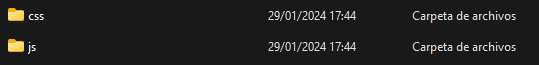
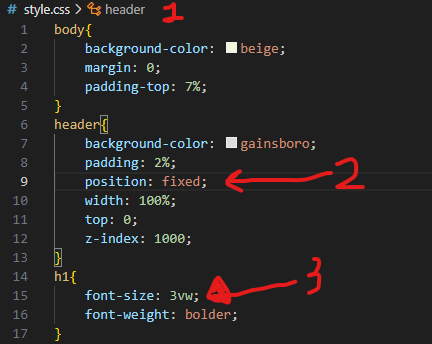
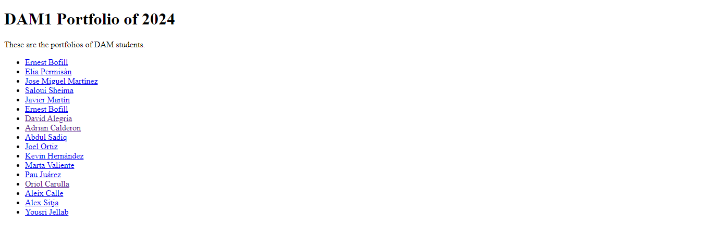
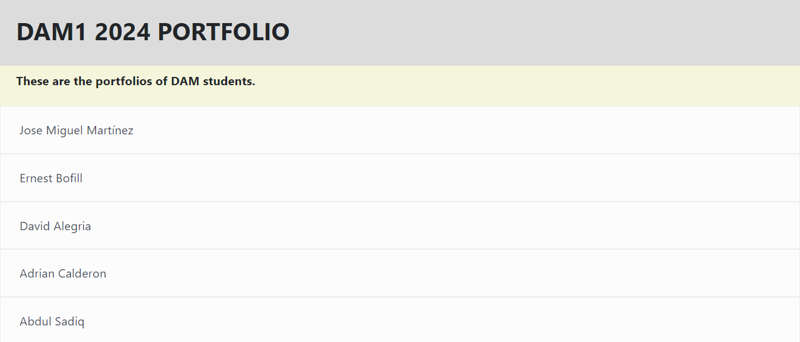
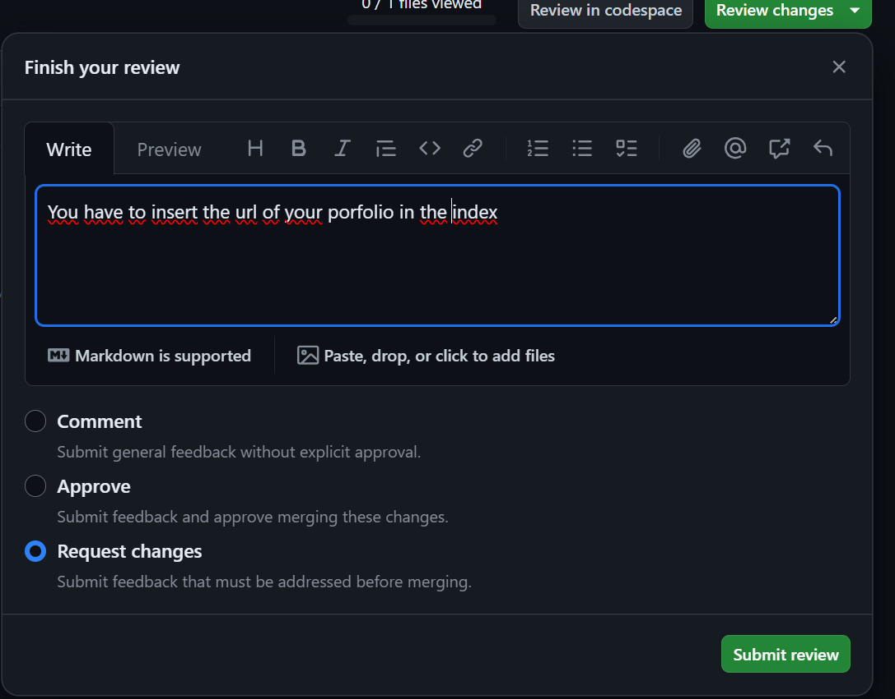
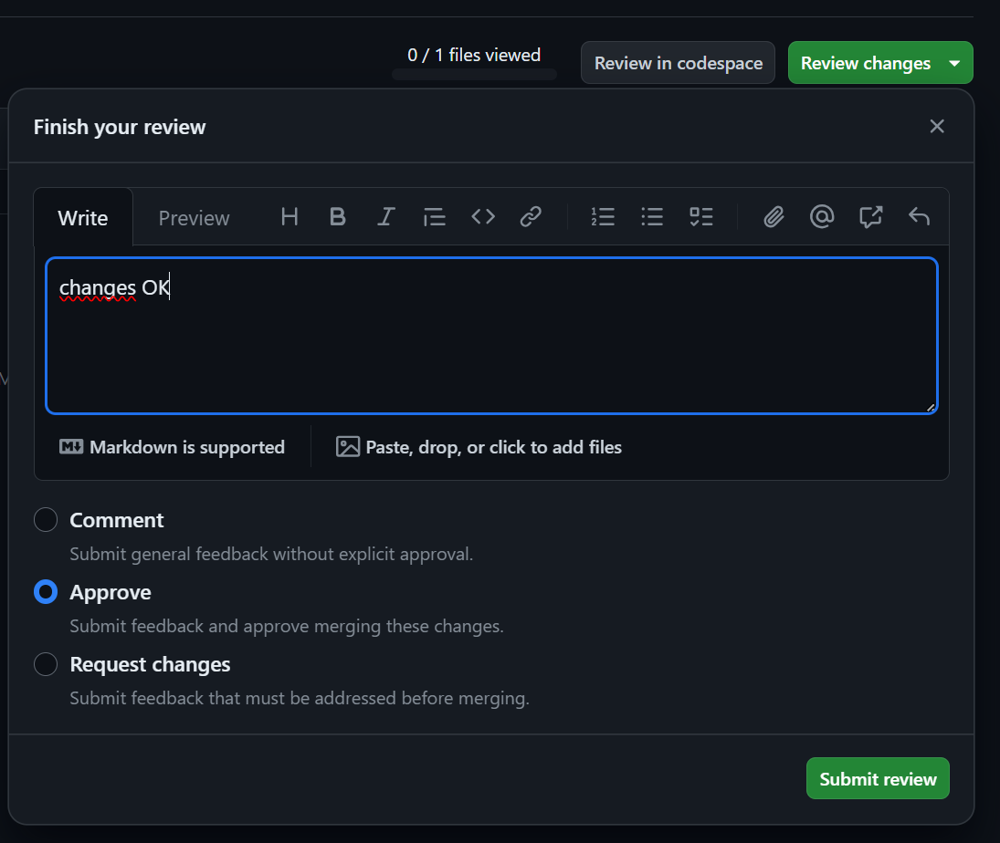
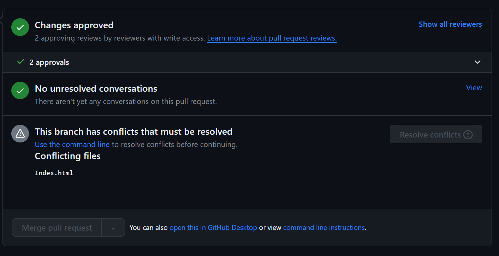

# dam1-2024-portfolio

## CSS group:

### Summary
>We managed to add that Bootstrap thing, we also changed the **header**'s color to a light-gray, also we added both CSS: the bootstrap and ours. We made the list look better, at least the **full page responsive** so it changes when you're looking at it from a mobile device. We made the padding bigger from the bootstrap. We also added an Icon to the page. We fixed the header position so it won't change.
---
### Install Bootstrap
1. First go to her web and Download this: https://getbootstrap.com/docs/5.0/getting-started/download/

2. Extract this.

3. Copy the two folder an putit in your **HTML**.

### Create css
1. CSS.

2. Header fixed in top.

3. Text responsive

4. Implement Bootstrap

### After

### Now

FAREM UNA PROVA DE PR

## Quality

In the Quality department, comprised of Aleix Calle, Alex Sitja, and Sheima Saloui, we have performed the following functions on GitHub:

### 1. HTML and CSS Review:
- A thorough review of each colleague's HTML and CSS code has been conducted.
- Comments were added indicating where information needed to be added or removed, such as white spaces or missing information.

### 2. Approval for the Second Phase:
- The work of colleagues has been evaluated, and approval has been granted to those who successfully addressed the errors identified in the initial review.

### 3. Portfolio Development:
- The goal is to have a minimal version of each team member's portfolio by the end of the week.
- The final version should be merged into the main branch through a Pull Request (PR).

Our team has been reminded of the importance of promptly reviewing Pull Requests, as colleagues will be waiting for approval. This ensures efficient collaboration and continuous progress in the project development.
