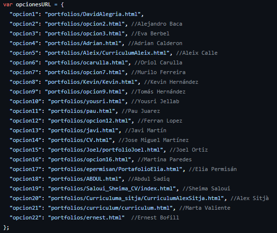
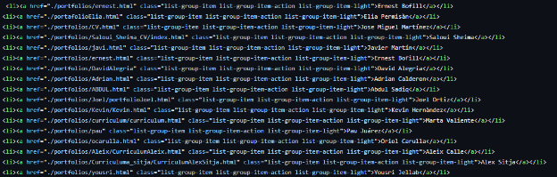

# dam1-2024-portfolio
## ReadMe
Hem creat la nostra pàgina web d'índex de la següent manera:

En primer lloc, hem afegit l'enllaç per a cadascun dels estudiants de DAM, on dins de cadascun d'ells trobem el seu portfolio.
Hem decidit accedir al portfolio dels alumnes mitjançant una barra desplegable on podem seleccionar-ne el que vulguem.
Un cop seleccionat l'alumne, prement el botó "enviar", accedirem dins del seu portfolio

Aprofundint més en el programa trobem que l'índex, hem utilitzat enllaços en el nostre codi HTML per a relacionar-ho amb el menú al seleccionar el portfolio d'algun estudiant

Després per part del treball del grup de css van cambiar el codi per a que s’apliques el css dintre del nostre index.

