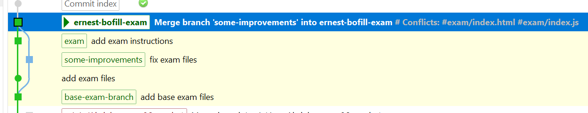
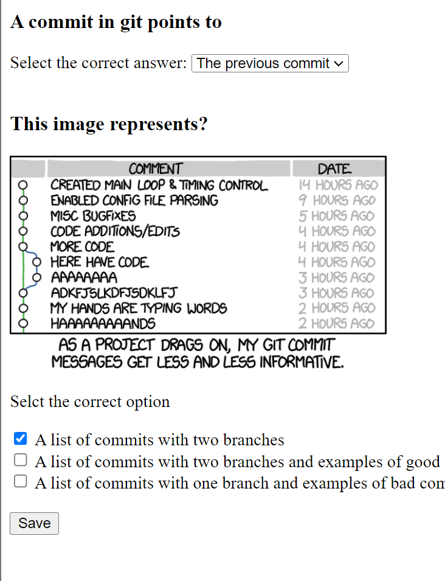

# Instructions
1. Create a new branch out of the existing `exam` branch. The branch name is `yourname-exam`
1. Merge the existing `some-improvements` branch into your branch.
   - There will be some merge conflicts, use a merge tool such as kdiff or VSCode to resolve the merge conflicts selecting the better option.
   - In every conflict, keep the changes from the `some-improvements` branch.
   - Kdiff is optional. As you know, any code editor can be used as a merge tool.
1. After the merge, the git history will look like this:

1. Edit `index.html` to add the attribute `checked` to the checkbox with the correct answer.
Like this: ``<input type="checkbox" checked...``
1. The page will look like this:

1. Commit and push your changes
1. Make a **Pull request** into the `main` branch
1. Hand the **link** to the pull request in task submission
2. You're done. Good job!

# Instrucciones
1. Cree una nueva rama a partir de la rama "examen" existente. El nombre de la sucursal es `tunombre-examen`
1. Fusione la rama existente "algunas mejoras" en su rama.
   - Habrá algunos conflictos de fusión, utilice una herramienta de fusión como kdiff o VSCode para resolver los conflictos de fusión seleccionando la mejor opción.
   - En cada conflicto, mantenga los cambios de la rama "algunas mejoras".
   - Kdiff es opcional. Como sabes, cualquier editor de código se puede utilizar como herramienta de combinación.
1. Después de la fusión, el historial de git se verá así:

1. Edite `index.html` para agregar el atributo `checked` a la casilla de verificación con la respuesta correcta.
Así: ``<tipo de entrada="casilla de verificación" marcada...``
1. La página se verá así:

1. Confirme e impulse sus cambios
1. Realice una **solicitud de extracción** en la rama "principal".
1. Entregue el **enlace** a la solicitud de extracción en el envío de la tarea.
2. Ya terminaste. ¡Buen trabajo!